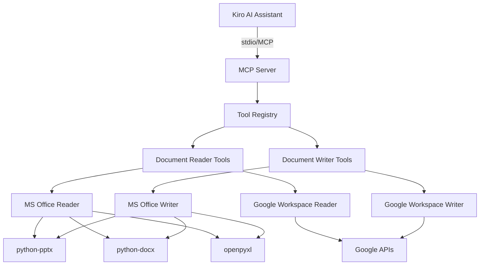

# 設計書

## 概要

本MCPサーバは、Kiro AIアシスタントに対してMicrosoft Office形式（PowerPoint、Word、Excel）およびGoogle Workspace形式（スプレッドシート、ドキュメント、スライド）のファイルを読み取り・生成する機能を提供します。

Pythonで実装し、Model Context Protocol（MCP）仕様に準拠したサーバとして動作します。標準入出力（stdio）を介してKiroと通信し、ツール呼び出しを通じてドキュメント操作機能を公開します。

### 技術スタック

- **言語**: Python 3.10以上
- **MCPフレームワーク**: `mcp` パッケージ
- **Microsoft Office処理**: 
  - `python-pptx` (PowerPoint)
  - `python-docx` (Word)
  - `openpyxl` (Excel)
- **Google API処理**: 
  - `google-api-python-client`
  - `google-auth-oauthlib`
  - `google-auth-httplib2`

## アーキテクチャ

### システム構成図



### レイヤー構造

1. **MCPサーバレイヤー**: MCP仕様に準拠した通信処理
2. **ツールレジストリレイヤー**: 利用可能なツールの登録と管理
3. **ドキュメント処理レイヤー**: 読み取り・書き込みロジックの実装
4. **ライブラリレイヤー**: 外部ライブラリとのインターフェース

## コンポーネントとインターフェース

### 1. MCPサーバコンポーネント (`server.py`)

MCPサーバのエントリーポイント。標準入出力を介してKiroと通信します。

```python
class DocumentMCPServer:
    """MCP Server for document format handling"""
    
    def __init__(self):
        self.server = Server("document-format-server")
        self._register_tools()
    
    def _register_tools(self):
        """Register all available tools"""
        pass
    
    async def run(self):
        """Start the MCP server"""
        pass
```

### 2. ドキュメントリーダーコンポーネント

#### PowerPointリーダー (`readers/powerpoint_reader.py`)

```python
class PowerPointReader:
    """Read PowerPoint (.pptx) files"""
    
    def __init__(self, max_slides: int = 500, max_file_size_mb: int = 100):
        """
        Initialize PowerPoint reader with configuration
        
        Args:
            max_slides: Maximum number of slides to process
            max_file_size_mb: Maximum file size in MB
        """
        self.max_slides = max_slides
        self.max_file_size_mb = max_file_size_mb
    
    def read_file(self, file_path: str) -> dict:
        """
        Extract content from PowerPoint file
        
        Returns:
            {
                "slides": [
                    {
                        "slide_number": int,
                        "title": str,
                        "content": str,
                        "notes": str,
                        "tables": [...]
                    }
                ]
            }
        """
        pass
```

#### Wordリーダー (`readers/word_reader.py`)

```python
class WordReader:
    """Read Word (.docx) files"""
    
    def __init__(self, max_file_size_mb: int = 100):
        """
        Initialize Word reader with configuration
        
        Args:
            max_file_size_mb: Maximum file size in MB
        """
        self.max_file_size_mb = max_file_size_mb
    
    def read_file(self, file_path: str) -> dict:
        """
        Extract content from Word file
        
        Returns:
            {
                "paragraphs": [
                    {
                        "text": str,
                        "style": str,  # "Heading 1", "Normal", etc.
                        "level": int
                    }
                ],
                "tables": [...]
            }
        """
        pass
```

#### Excelリーダー (`readers/excel_reader.py`)

```python
class ExcelReader:
    """Read Excel (.xlsx) files"""
    
    def __init__(self, max_sheets: int = 100, max_file_size_mb: int = 100):
        """
        Initialize Excel reader with configuration
        
        Args:
            max_sheets: Maximum number of sheets to process
            max_file_size_mb: Maximum file size in MB
        """
        self.max_sheets = max_sheets
        self.max_file_size_mb = max_file_size_mb
    
    def read_file(self, file_path: str) -> dict:
        """
        Extract content from Excel file
        
        Returns:
            {
                "sheets": [
                    {
                        "name": str,
                        "data": [[cell_value, ...], ...],
                        "formulas": {...}
                    }
                ]
            }
        """
        pass
```

#### Google Workspaceリーダー (`readers/google_reader.py`)

```python
class GoogleWorkspaceReader:
    """Read Google Workspace files"""
    
    def __init__(self, credentials_path: str, api_timeout_seconds: int = 60, max_retries: int = 3):
        """
        Initialize Google Workspace reader with configuration
        
        Args:
            credentials_path: Path to Google API credentials
            api_timeout_seconds: Timeout for API calls in seconds
            max_retries: Maximum number of retry attempts
        """
        self.credentials = self._load_credentials(credentials_path)
        self.api_timeout = api_timeout_seconds
        self.max_retries = max_retries
    
    def read_spreadsheet(self, file_id: str) -> dict:
        """Read Google Spreadsheet with retry logic"""
        pass
    
    def read_document(self, file_id: str) -> dict:
        """Read Google Document with retry logic"""
        pass
    
    def read_slides(self, file_id: str) -> dict:
        """Read Google Slides with retry logic"""
        pass
    
    def _execute_with_retry(self, request):
        """Execute API request with retry and timeout"""
        pass
```

### 3. ドキュメントライターコンポーネント

#### PowerPointライター (`writers/powerpoint_writer.py`)

```python
class PowerPointWriter:
    """Write PowerPoint (.pptx) files"""
    
    def create_presentation(self, data: dict, output_path: str) -> str:
        """
        Create PowerPoint file from structured data
        
        Args:
            data: {
                "title": str,
                "slides": [
                    {
                        "layout": "title" | "content" | "bullet",
                        "title": str,
                        "content": str | list
                    }
                ]
            }
        
        Returns:
            Path to created file
        """
        pass
```

#### Wordライター (`writers/word_writer.py`)

```python
class WordWriter:
    """Write Word (.docx) files"""
    
    def create_document(self, data: dict, output_path: str) -> str:
        """
        Create Word file from structured data
        
        Args:
            data: {
                "title": str,
                "sections": [
                    {
                        "heading": str,
                        "level": int,
                        "paragraphs": [str, ...],
                        "tables": [...]
                    }
                ]
            }
        
        Returns:
            Path to created file
        """
        pass
```

#### Excelライター (`writers/excel_writer.py`)

```python
class ExcelWriter:
    """Write Excel (.xlsx) files"""
    
    def create_workbook(self, data: dict, output_path: str) -> str:
        """
        Create Excel file from structured data
        
        Args:
            data: {
                "sheets": [
                    {
                        "name": str,
                        "data": [[cell_value, ...], ...],
                        "formatting": {...}
                    }
                ]
            }
        
        Returns:
            Path to created file
        """
        pass
```

#### Google Workspaceライター (`writers/google_writer.py`)

```python
class GoogleWorkspaceWriter:
    """Write Google Workspace files"""
    
    def __init__(self, credentials_path: str, api_timeout_seconds: int = 60, max_retries: int = 3):
        """
        Initialize Google Workspace writer with configuration
        
        Args:
            credentials_path: Path to Google API credentials
            api_timeout_seconds: Timeout for API calls in seconds
            max_retries: Maximum number of retry attempts
        """
        self.credentials = self._load_credentials(credentials_path)
        self.api_timeout = api_timeout_seconds
        self.max_retries = max_retries
    
    def create_spreadsheet(self, data: dict, title: str) -> str:
        """Create Google Spreadsheet and return URL with retry logic"""
        pass
    
    def create_document(self, data: dict, title: str) -> str:
        """Create Google Document and return URL with retry logic"""
        pass
    
    def create_slides(self, data: dict, title: str) -> str:
        """Create Google Slides and return URL with retry logic"""
        pass
    
    def _execute_with_retry(self, request):
        """Execute API request with retry and timeout"""
        pass
```

### 4. ツール定義 (`tools/`)

MCPツールとして公開される機能：

- `read_powerpoint`: PowerPointファイルを読み取る
- `read_word`: Wordファイルを読み取る
- `read_excel`: Excelファイルを読み取る
- `read_google_spreadsheet`: Googleスプレッドシートを読み取る
- `read_google_document`: Googleドキュメントを読み取る
- `read_google_slides`: Googleスライドを読み取る
- `write_powerpoint`: PowerPointファイルを生成する
- `write_word`: Wordファイルを生成する
- `write_excel`: Excelファイルを生成する
- `write_google_spreadsheet`: Googleスプレッドシートを生成する
- `write_google_document`: Googleドキュメントを生成する
- `write_google_slides`: Googleスライドを生成する

#### ツールハンドラー (`tools/tool_handlers.py`)

```python
class ToolHandlers:
    """Handle MCP tool calls and coordinate with readers/writers"""
    
    def __init__(self, config: dict):
        """
        Initialize tool handlers with configuration
        
        Args:
            config: Configuration dictionary with limits and settings
        """
        # リーダーを設定値で初期化
        self.powerpoint_reader = PowerPointReader(
            max_slides=config.get('max_slides', 500),
            max_file_size_mb=config.get('max_file_size_mb', 100)
        )
        self.word_reader = WordReader(
            max_file_size_mb=config.get('max_file_size_mb', 100)
        )
        self.excel_reader = ExcelReader(
            max_sheets=config.get('max_sheets', 100),
            max_file_size_mb=config.get('max_file_size_mb', 100)
        )
        self.google_reader = GoogleWorkspaceReader(
            credentials_path=config.get('google_credentials_path'),
            api_timeout_seconds=config.get('api_timeout_seconds', 60),
            max_retries=config.get('max_retries', 3)
        )
        
        # ライターを初期化
        self.powerpoint_writer = PowerPointWriter()
        self.word_writer = WordWriter()
        self.excel_writer = ExcelWriter()
        self.google_writer = GoogleWorkspaceWriter(
            credentials_path=config.get('google_credentials_path'),
            api_timeout_seconds=config.get('api_timeout_seconds', 60),
            max_retries=config.get('max_retries', 3)
        )
    
    def handle_read_powerpoint(self, file_path: str) -> dict:
        """Handle PowerPoint read requests"""
        pass
    
    def handle_write_powerpoint(self, data: dict, output_path: str) -> dict:
        """Handle PowerPoint write requests"""
        pass
    
    # 他のハンドラーメソッド...
    
    def _success_response(self, data: dict) -> dict:
        """Return success response in JSON format"""
        return {"success": True, "data": data}
    
    def _error_response(self, error_type: str, message: str, details: dict = None) -> dict:
        """Return error response in JSON format (not stringified)"""
        return {
            "success": False,
            "error": {
                "type": error_type,
                "message": message,
                "details": details or {}
            }
        }
```

## データモデル

### 共通データ構造

#### DocumentContent

```python
@dataclass
class DocumentContent:
    """Base class for document content"""
    format_type: str  # "pptx", "docx", "xlsx", "google_sheets", etc.
    metadata: dict
    content: dict
```

#### ReadResult

```python
@dataclass
class ReadResult:
    """Result of document read operation"""
    success: bool
    content: Optional[DocumentContent]
    error: Optional[str]
    file_path: str
```

#### WriteResult

```python
@dataclass
class WriteResult:
    """Result of document write operation"""
    success: bool
    output_path: Optional[str]
    url: Optional[str]  # For Google Workspace files
    error: Optional[str]
```

### データモデルの使用方針

**設計決定**: 全てのリーダーとライターは共通データモデルを使用し、型安全性を確保します。

- **ReadResult**: 全てのリーダーの`read_file`メソッドは`ReadResult`を返す
- **WriteResult**: 全てのライターの`create_*`メソッドは`WriteResult`を返す
- **DocumentContent**: 抽出されたコンテンツは`DocumentContent`でラップされる
- **型安全性**: 生の辞書ではなく、データクラスを使用してランタイムエラーを防ぐ

## 正確性プロパティ

*プロパティとは、システムの全ての有効な実行において真であるべき特性や動作のことです。プロパティは、人間が読める仕様と機械で検証可能な正確性保証の橋渡しとして機能します。*

### プロパティ1: ドキュメント読み取りの完全性
*任意の*有効なドキュメントファイル（PowerPoint、Word、Excel）に対して、Document_Readerは必要な全ての構造要素（タイトル、コンテンツ、メタデータ）を抽出し、構造化された形式で返すべきである
**検証対象: 要件 1.1, 1.2, 1.4, 2.1, 2.2, 3.1, 3.2**

### プロパティ2: データ形式の一貫性
*任意の*ドキュメント読み取り操作において、抽出されたデータは指定された構造化形式（JSON、CSV、マークダウン）のいずれかで提供されるべきである
**検証対象: 要件 2.3, 3.3**

### プロパティ3: エラーハンドリングの統一性
*任意の*無効なファイル（破損、存在しない、アクセス不可）に対して、MCP_Serverは明確で一貫したエラーメッセージを返すべきである
**検証対象: 要件 1.3, 2.4, 3.4, 4.5, 5.5, 6.5, 7.5, 8.5**

### プロパティ4: 制限値の遵守
*任意の*Excelファイルに対して、Document_Readerは最大100シートまでの制限を遵守し、制限を超える場合は適切に処理するべきである
**検証対象: 要件 3.5**

### プロパティ5: Google API統合の一貫性
*任意の*有効なGoogle WorkspaceファイルID/URLに対して、Document_Readerは対応するGoogle APIを使用してデータを取得するべきである
**検証対象: 要件 4.1, 4.2, 4.3**

### プロパティ6: ドキュメント生成の完全性
*任意の*有効な構造化データに対して、Document_Writerは対応する形式のドキュメントファイルを生成し、必要な要素（タイトル、コンテンツ、書式）を含むべきである
**検証対象: 要件 5.1, 5.2, 5.4, 6.1, 6.2, 6.3, 7.1, 7.2, 7.3**

### プロパティ7: ファイル保存の確実性
*任意の*ドキュメント生成操作において、Document_Writerは生成したファイルをユーザーがアクセス可能な場所に保存し、そのパスまたはURLを返すべきである
**検証対象: 要件 5.3, 6.4, 7.4, 8.4**

### プロパティ8: Google Workspace作成の一貫性
*任意の*有効な構造化データに対して、Document_Writerは対応するGoogle APIを使用して新しいファイルを作成し、アクセス可能なURLを返すべきである
**検証対象: 要件 8.1, 8.2, 8.3, 8.4**

### プロパティ9: MCPツール公開の完全性
*任意の*MCP_Server起動時において、全ての必要なツール（12個の読み取り/書き込み機能）がKiroに公開されるべきである
**検証対象: 要件 9.2**

### プロパティ10: 通信プロトコルの準拠
*任意の*ツール呼び出しに対して、MCP_Serverは標準入出力を介して明確な成功または失敗の応答を返すべきである
**検証対象: 要件 9.3, 9.5**

### プロパティ11: 初期化性能の保証
*任意の*MCP_Server起動において、初期化は30秒以内に完了し、TypeErrorなしで正常に動作するべきである
**検証対象: 要件 9.4, 11.3**

### プロパティ12: 開発環境スクリプトの動作保証
*任意の*開発環境において、サンプルファイル生成スクリプトは必要なテストファイル（PowerPoint、Word、Excel）を生成し、テストスクリプトは各リーダーの動作を検証するべきである
**検証対象: 要件 10.2, 10.4**

### プロパティ13: 設定値の適用
*任意の*リーダー初期化において、設定値（max_sheets、max_file_size_mb、max_slides）が正しく適用され、制限の検証が実行されるべきである
**検証対象: 要件 11.1, 11.2, 11.8**

### プロパティ14: データモデルの一貫性
*任意の*読み取り/書き込み操作において、共通データモデル（DocumentContent、ReadResult、WriteResult）が使用され、一貫した形式でデータが処理されるべきである
**検証対象: 要件 11.5**

### プロパティ15: API呼び出しの信頼性
*任意の*Google API呼び出しにおいて、最大3回のリトライと60秒のタイムアウトが実装され、一時的な障害に対する耐性を提供するべきである
**検証対象: 要件 11.7**

## エラーハンドリング

### エラータイプ

1. **FileNotFoundError**: ファイルが存在しない
2. **CorruptedFileError**: ファイルが破損している
3. **AuthenticationError**: Google API認証エラー
4. **PermissionError**: ファイルアクセス権限エラー
5. **APIError**: Google APIエラー
6. **ValidationError**: 入力データの検証エラー

### エラーレスポンス形式

MCPツールは以下の形式でエラーを返す必要があります：

```python
{
    "success": False,
    "error": {
        "type": "FileNotFoundError",
        "message": "指定されたファイルが見つかりません: /path/to/file.pptx",
        "details": {...}
    }
}
```

**重要**: エラーレスポンスは文字列化せず、直接JSON構造として返す必要があります。クライアント側で再パースする必要がないようにします。

### エラーハンドリング戦略

**設計決定**: 統一されたエラーハンドリングにより、一貫したユーザーエクスペリエンスを提供します。

- すべての例外をキャッチし、適切なエラーメッセージを返す
- ファイル操作前にファイルの存在と読み取り権限を確認
- ファイルサイズ制限を検証（設定値に基づく）
- シート数/スライド数制限を検証（設定値に基づく）
- Google API呼び出しはリトライロジックを実装（最大3回、指数バックオフ）
- タイムアウト設定: ファイル読み取り30秒、API呼び出し60秒

### 制限値の検証

**設計決定**: 設定可能な制限値により、リソース使用量を制御し、システムの安定性を確保します。

```python
class DocumentReader:
    """Base class for document readers with validation"""
    
    def validate_file_size(self, file_path: str) -> None:
        """Validate file size against configured limits"""
        file_size_mb = os.path.getsize(file_path) / (1024 * 1024)
        if file_size_mb > self.max_file_size_mb:
            raise ValidationError(f"ファイルサイズが制限を超えています: {file_size_mb:.1f}MB > {self.max_file_size_mb}MB")
    
    def validate_content_limits(self, content_count: int, limit: int, content_type: str) -> None:
        """Validate content count against configured limits"""
        if content_count > limit:
            raise ValidationError(f"{content_type}数が制限を超えています: {content_count} > {limit}")
```

## テスト戦略

### 二重テストアプローチ

本プロジェクトでは、包括的なテストカバレッジを確保するために、ユニットテストとプロパティベーステストの両方を実装します：

- **ユニットテスト**: 特定の例、エッジケース、エラー条件を検証
- **プロパティベーステスト**: 全ての入力に対する普遍的なプロパティを検証
- 両方のテストは相補的であり、包括的なカバレッジに必要です

### ユニットテスト

各コンポーネントの個別機能をテスト：

- `tests/readers/test_powerpoint_reader.py`
- `tests/readers/test_word_reader.py`
- `tests/readers/test_excel_reader.py`
- `tests/readers/test_google_reader.py`
- `tests/writers/test_powerpoint_writer.py`
- `tests/writers/test_word_writer.py`
- `tests/writers/test_excel_writer.py`
- `tests/writers/test_google_writer.py`

**ユニットテストのバランス:**
- ユニットテストは特定の例とエッジケースに有用
- プロパティベーステストが多くの入力をカバーするため、過度なユニットテストは避ける
- ユニットテストの焦点：
  - 正しい動作を示す特定の例
  - コンポーネント間の統合ポイント
  - エッジケースとエラー条件

### プロパティベーステスト

**設定:**
- 各プロパティテストは最小100回の反復を実行（ランダム化のため）
- 各プロパティテストは設計書のプロパティを参照する必要がある
- タグ形式: **Feature: document-format-mcp-server, Property {番号}: {プロパティテキスト}**
- 各正確性プロパティは単一のプロパティベーステストで実装される

**プロパティベーステストライブラリ:**
- **Python**: `hypothesis` パッケージを使用
- 最小100回の反復で設定
- 各テストは対応する設計書プロパティにタグ付け

**プロパティテストの焦点:**
- 全ての入力に対して成り立つ普遍的なプロパティ
- ランダム化による包括的な入力カバレッジ

### 統合テスト

- MCPサーバとツールの統合テスト
- 実際のファイルを使用したエンドツーエンドテスト
- Google APIのモックを使用したテスト

### テストデータ

- `tests/fixtures/`: サンプルファイル（.pptx、.docx、.xlsx）
- Google APIはモックまたはテスト用アカウントを使用

## セキュリティ考慮事項

### 認証情報の管理

- Google API認証情報は環境変数または設定ファイルから読み込む
- 認証情報ファイルのパスは設定可能
- 認証情報をログに出力しない

### ファイルアクセス制限

- 読み取り可能なファイルパスを制限（サンドボックス化）
- 書き込み先ディレクトリを制限
- パストラバーサル攻撃を防ぐ

### データ検証

- ファイルサイズ制限: 最大100MB
- シート数制限: 最大100シート（Excel）
- スライド数制限: 最大500スライド（PowerPoint）

## 設定管理

### 設定ファイル (`config.json`)

```json
{
  "google_credentials_path": "~/.config/kiro-mcp/google-credentials.json",
  "output_directory": "~/Documents/kiro-output",
  "max_file_size_mb": 100,
  "max_sheets": 100,
  "max_slides": 500,
  "api_timeout_seconds": 60,
  "max_retries": 3,
  "enable_google_workspace": true
}
```

### 環境変数

- `GOOGLE_APPLICATION_CREDENTIALS`: Google API認証情報ファイルパス
- `MCP_OUTPUT_DIR`: 出力ファイルディレクトリ
- `MCP_LOG_LEVEL`: ログレベル（DEBUG、INFO、WARNING、ERROR）

### 設定値の適用

**設計決定**: 設定値は初期化時にリーダー/ライタークラスに渡され、実行時に制限が適用されます。

```python
class ConfigManager:
    """Manage configuration loading and validation"""
    
    @staticmethod
    def load_config(config_path: str = None) -> dict:
        """Load configuration from file and environment variables"""
        # デフォルト設定
        default_config = {
            "max_file_size_mb": 100,
            "max_sheets": 100,
            "max_slides": 500,
            "api_timeout_seconds": 60,
            "max_retries": 3
        }
        
        # 設定ファイルから読み込み
        if config_path and os.path.exists(config_path):
            with open(config_path, 'r') as f:
                file_config = json.load(f)
            default_config.update(file_config)
        
        # 環境変数で上書き
        env_overrides = {
            "google_credentials_path": os.getenv("GOOGLE_APPLICATION_CREDENTIALS"),
            "output_directory": os.getenv("MCP_OUTPUT_DIR"),
            "log_level": os.getenv("MCP_LOG_LEVEL", "INFO")
        }
        
        for key, value in env_overrides.items():
            if value is not None:
                default_config[key] = value
        
        return default_config
```

## デプロイメント

### パッケージ構造

```
document-format-mcp-server/
├── src/
│   └── document_format_mcp_server/
│       ├── __init__.py
│       ├── server.py
│       ├── readers/
│       │   ├── __init__.py
│       │   ├── powerpoint_reader.py
│       │   ├── word_reader.py
│       │   ├── excel_reader.py
│       │   └── google_reader.py
│       ├── writers/
│       │   ├── __init__.py
│       │   ├── powerpoint_writer.py
│       │   ├── word_writer.py
│       │   ├── excel_writer.py
│       │   └── google_writer.py
│       ├── tools/
│       │   ├── __init__.py
│       │   ├── tool_definitions.py
│       │   └── tool_handlers.py
│       └── utils/
│           ├── __init__.py
│           ├── config.py
│           ├── errors.py
│           ├── models.py
│           └── logging_config.py
├── tests/
│   ├── readers/
│   └── writers/
├── scripts/
│   ├── setup/
│   │   └── create_sample_files.py
│   └── demo/
│       └── test_readers.py
├── docs/
│   ├── QUICKSTART.md
│   └── SETUP.md
├── pyproject.toml
├── README.md
└── config.json.example
```

### インストール方法

```bash
# uvxを使用してインストール
uvx document-format-mcp-server

# または、pipを使用
pip install document-format-mcp-server
```

### Kiro設定 (`.kiro/settings/mcp.json`)

```json
{
  "mcpServers": {
    "document-format": {
      "command": "uvx",
      "args": ["document-format-mcp-server"],
      "env": {
        "GOOGLE_APPLICATION_CREDENTIALS": "~/.config/kiro-mcp/google-credentials.json",
        "MCP_OUTPUT_DIR": "~/Documents/kiro-output"
      },
      "disabled": false,
      "autoApprove": []
    }
  }
}
```

## パフォーマンス考慮事項

### 最適化戦略

- 大きなファイルは段階的に読み込む（ストリーミング）
- キャッシュ機構: 同じファイルの再読み込みを避ける
- 並列処理: 複数シートの処理を並列化

### リソース制限

- メモリ使用量: 最大500MB
- 処理時間: 1ファイルあたり最大5分
- 同時処理数: 最大3ファイル

## 開発・テスト環境

### ローカル開発環境のセットアップ

#### 環境構築ツール

プロジェクトは以下のツールをサポート：

- **uv** (推奨): 高速なPythonパッケージマネージャー
- **pip**: 標準的なPythonパッケージマネージャー
- **venv**: Python標準の仮想環境

#### セットアップ手順

```bash
# uvを使用する場合（推奨）
uv venv
.venv\Scripts\activate  # Windows
uv pip install -r requirements.txt

# pipを使用する場合
python -m venv .venv
.venv\Scripts\activate  # Windows
pip install -r requirements.txt
```

### テストツール

#### 1. サンプルファイル生成スクリプト (`create_sample_files.py`)

テスト用のサンプルファイルを自動生成するスクリプト。

**機能:**
- PowerPointファイル（3スライド、表を含む）の生成
- Wordファイル（見出し、段落、箇条書き、表を含む）の生成
- Excelファイル（3シート、データと数式を含む）の生成

**使用方法:**
```bash
python create_sample_files.py
```

**出力:**
- `test_files/sample.pptx`
- `test_files/sample.docx`
- `test_files/sample.xlsx`

#### 2. リーダー機能テストスクリプト (`test_readers.py`)

実装済みのリーダー機能を検証するスクリプト。

**機能:**
- ローカルファイル（PowerPoint、Word、Excel）の読み取りテスト
- Google Workspaceファイル（スプレッドシート、ドキュメント、スライド）の読み取りテスト
- 読み込んだ内容の表示と検証

**使用方法:**
```bash
# ローカルファイルのテスト
python test_readers.py

# Google Workspaceファイルのテスト
python test_readers.py --google
```

**テスト項目:**
- ファイルの正常読み込み
- データ構造の検証
- エラーハンドリングの確認
- 抽出されたコンテンツの表示

### テストデータ構造

#### PowerPointテストデータ

```python
{
    "slides": [
        {
            "slide_number": 1,
            "title": "サンプルプレゼンテーション",
            "content": "Document Format MCP Server テスト用",
            "notes": "",
            "tables": []
        },
        {
            "slide_number": 2,
            "title": "機能紹介",
            "content": "主な機能:\n  PowerPointファイルの読み取り\n  ...",
            "notes": "",
            "tables": []
        },
        {
            "slide_number": 3,
            "title": "データ表",
            "content": "",
            "notes": "",
            "tables": [
                {
                    "rows": 4,
                    "columns": 3,
                    "data": [
                        ["項目", "値", "備考"],
                        ["読み取り", "対応", "完了"],
                        ...
                    ]
                }
            ]
        }
    ]
}
```

#### Wordテストデータ

```python
{
    "paragraphs": [
        {
            "text": "サンプルドキュメント",
            "type": "heading",
            "level": 0,
            "style": "Title"
        },
        {
            "text": "これはDocument Format MCP Serverのテスト用...",
            "type": "paragraph",
            "style": "Normal"
        },
        ...
    ],
    "tables": [
        {
            "rows": 4,
            "columns": 3,
            "data": [...]
        }
    ]
}
```

#### Excelテストデータ

```python
{
    "sheets": [
        {
            "name": "データ",
            "data": [
                ["ID", "名前", "カテゴリ", "値"],
                [1, "PowerPoint", "読み取り", "完了"],
                ...
            ],
            "row_count": 7,
            "column_count": 4,
            "formulas": {}
        },
        {
            "name": "統計",
            "data": [...],
            "row_count": 4,
            "column_count": 2,
            "formulas": {}
        },
        {
            "name": "計算",
            "data": [...],
            "row_count": 5,
            "column_count": 3,
            "formulas": {
                "C4": "=B2+B3",
                "C5": "=(B2+B3)/2"
            }
        }
    ]
}
```

### Google Workspace認証設定

#### 認証情報の取得

1. [Google Cloud Console](https://console.cloud.google.com/)でプロジェクトを作成
2. 以下のAPIを有効化:
   - Google Sheets API
   - Google Docs API
   - Google Slides API
3. OAuth 2.0クライアントID（デスクトップアプリ）を作成
4. 認証情報JSONファイルをダウンロード

#### 認証情報の配置

```bash
# 推奨ディレクトリ構造
.config/
  └── google-credentials.json  # OAuth 2.0クライアント認証情報
  └── token.json              # 自動生成される認証トークン
```

#### 認証フロー

1. 初回実行時、ブラウザが開いてGoogle認証が求められる
2. Googleアカウントでログインし、アクセス許可を承認
3. 認証トークンが`token.json`に保存される
4. 以降の実行では保存されたトークンを使用

### ドキュメント

#### クイックスタートガイド (`QUICKSTART.md`)

5分で動作確認できる簡潔なガイド：
- 環境セットアップ（2分）
- サンプルファイル生成（1分）
- テスト実行（2分）
- Google Workspaceテスト（追加10分）

#### セットアップガイド (`SETUP.md`)

詳細なセットアップ手順：
- uvまたはpipでの環境構築
- テストファイルの準備方法
- Google認証情報の取得と設定
- トラブルシューティング
- 次のステップへの案内

### 開発ワークフロー

#### 1. 環境セットアップ

```bash
uv venv
.venv\Scripts\activate
uv pip install -r requirements.txt
```

#### 2. サンプルファイル生成

```bash
python create_sample_files.py
```

#### 3. リーダー機能のテスト

```bash
python test_readers.py
```

#### 4. 実装の検証

- 各リーダークラスが正しくファイルを読み込めることを確認
- データ構造が設計通りであることを確認
- エラーハンドリングが適切に動作することを確認

#### 5. 次の実装へ

- ライター機能の実装（タスク5-7）
- MCPツール統合（タスク8）
- パッケージング（タスク9-10）

### CI/CD統合（将来）

- GitHub Actionsでの自動テスト
- Pytestによるユニットテスト
- カバレッジレポート
- 自動デプロイメント

## ログ出力とモニタリング

### ログ設定

**設計決定**: 構造化されたログ出力により、デバッグとモニタリングを支援します。

```python
class LoggingConfig:
    """Configure logging for the MCP server"""
    
    @staticmethod
    def setup_logging(log_level: str = "INFO") -> None:
        """Setup logging configuration"""
        logging.basicConfig(
            level=getattr(logging, log_level.upper()),
            format='%(asctime)s - %(name)s - %(levelname)s - %(message)s',
            handlers=[
                logging.StreamHandler(),
                logging.FileHandler('mcp_server.log')
            ]
        )
```

### ログ出力ポイント

- **サーバ起動時**: 初期化完了とツール登録状況
- **ツール呼び出し時**: ツール名、パラメータ、実行時間
- **ファイル処理時**: 読み取り/書き込み開始、完了、エラー
- **API呼び出し時**: Google API呼び出しの成功/失敗、リトライ状況
- **エラー発生時**: 詳細なエラー情報とスタックトレース

### テストスイート構成

**設計決定**: 包括的なテストスイートにより、実装の正確性を保証します。

```
tests/
├── readers/
│   ├── test_powerpoint_reader.py
│   ├── test_word_reader.py
│   ├── test_excel_reader.py
│   └── test_google_reader.py
├── writers/
│   ├── test_powerpoint_writer.py
│   ├── test_word_writer.py
│   ├── test_excel_writer.py
│   └── test_google_writer.py
├── tools/
│   └── test_tool_handlers.py
├── utils/
│   ├── test_config.py
│   └── test_models.py
├── property_tests/
│   ├── test_properties_1_5.py
│   ├── test_properties_6_10.py
│   └── test_properties_11_15.py
└── integration/
    └── test_mcp_server.py
```
