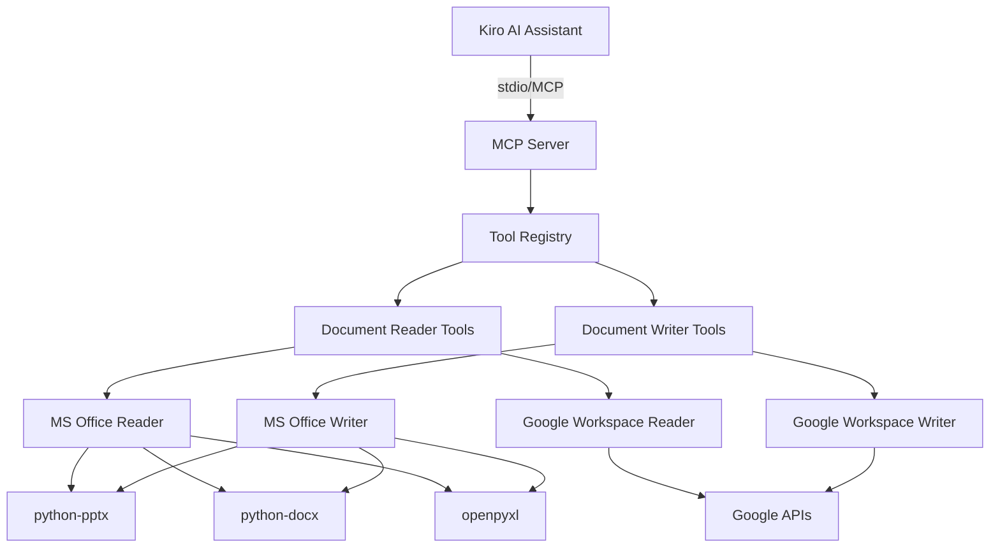

# 設計書

## 概要

本MCPサーバは、Kiro AIアシスタントに対してMicrosoft Office形式（PowerPoint、Word、Excel）およびGoogle Workspace形式（スプレッドシート、ドキュメント、スライド）のファイルを読み取り・生成する機能を提供します。

Pythonで実装し、Model Context Protocol（MCP）仕様に準拠したサーバとして動作します。標準入出力（stdio）を介してKiroと通信し、ツール呼び出しを通じてドキュメント操作機能を公開します。

### 技術スタック

- **言語**: Python 3.10以上
- **MCPフレームワーク**: `mcp` パッケージ
- **Microsoft Office処理**: 
  - `python-pptx` (PowerPoint)
  - `python-docx` (Word)
  - `openpyxl` (Excel)
- **Google API処理**: 
  - `google-api-python-client`
  - `google-auth-oauthlib`
  - `google-auth-httplib2`

## アーキテクチャ

### システム構成図



### レイヤー構造

1. **MCPサーバレイヤー**: MCP仕様に準拠した通信処理
2. **ツールレジストリレイヤー**: 利用可能なツールの登録と管理
3. **ドキュメント処理レイヤー**: 読み取り・書き込みロジックの実装
4. **ライブラリレイヤー**: 外部ライブラリとのインターフェース

## コンポーネントとインターフェース

### 1. MCPサーバコンポーネント (`server.py`)

MCPサーバのエントリーポイント。標準入出力を介してKiroと通信します。

```python
class DocumentMCPServer:
    """MCP Server for document format handling"""
    
    def __init__(self):
        self.server = Server("document-format-server")
        self._register_tools()
    
    def _register_tools(self):
        """Register all available tools"""
        pass
    
    async def run(self):
        """Start the MCP server"""
        pass
```

### 2. ドキュメントリーダーコンポーネント

#### PowerPointリーダー (`readers/powerpoint_reader.py`)

```python
class PowerPointReader:
    """Read PowerPoint (.pptx) files"""
    
    def read_file(self, file_path: str) -> dict:
        """
        Extract content from PowerPoint file
        
        Returns:
            {
                "slides": [
                    {
                        "slide_number": int,
                        "title": str,
                        "content": str,
                        "notes": str,
                        "tables": [...]
                    }
                ]
            }
        """
        pass
```

#### Wordリーダー (`readers/word_reader.py`)

```python
class WordReader:
    """Read Word (.docx) files"""
    
    def read_file(self, file_path: str) -> dict:
        """
        Extract content from Word file
        
        Returns:
            {
                "paragraphs": [
                    {
                        "text": str,
                        "style": str,  # "Heading 1", "Normal", etc.
                        "level": int
                    }
                ],
                "tables": [...]
            }
        """
        pass
```

#### Excelリーダー (`readers/excel_reader.py`)

```python
class ExcelReader:
    """Read Excel (.xlsx) files"""
    
    def read_file(self, file_path: str) -> dict:
        """
        Extract content from Excel file
        
        Returns:
            {
                "sheets": [
                    {
                        "name": str,
                        "data": [[cell_value, ...], ...],
                        "formulas": {...}
                    }
                ]
            }
        """
        pass
```

#### Google Workspaceリーダー (`readers/google_reader.py`)

```python
class GoogleWorkspaceReader:
    """Read Google Workspace files"""
    
    def __init__(self, credentials_path: str):
        self.credentials = self._load_credentials(credentials_path)
    
    def read_spreadsheet(self, file_id: str) -> dict:
        """Read Google Spreadsheet"""
        pass
    
    def read_document(self, file_id: str) -> dict:
        """Read Google Document"""
        pass
    
    def read_slides(self, file_id: str) -> dict:
        """Read Google Slides"""
        pass
```

### 3. ドキュメントライターコンポーネント

#### PowerPointライター (`writers/powerpoint_writer.py`)

```python
class PowerPointWriter:
    """Write PowerPoint (.pptx) files"""
    
    def create_presentation(self, data: dict, output_path: str) -> str:
        """
        Create PowerPoint file from structured data
        
        Args:
            data: {
                "title": str,
                "slides": [
                    {
                        "layout": "title" | "content" | "bullet",
                        "title": str,
                        "content": str | list
                    }
                ]
            }
        
        Returns:
            Path to created file
        """
        pass
```

#### Wordライター (`writers/word_writer.py`)

```python
class WordWriter:
    """Write Word (.docx) files"""
    
    def create_document(self, data: dict, output_path: str) -> str:
        """
        Create Word file from structured data
        
        Args:
            data: {
                "title": str,
                "sections": [
                    {
                        "heading": str,
                        "level": int,
                        "paragraphs": [str, ...],
                        "tables": [...]
                    }
                ]
            }
        
        Returns:
            Path to created file
        """
        pass
```

#### Excelライター (`writers/excel_writer.py`)

```python
class ExcelWriter:
    """Write Excel (.xlsx) files"""
    
    def create_workbook(self, data: dict, output_path: str) -> str:
        """
        Create Excel file from structured data
        
        Args:
            data: {
                "sheets": [
                    {
                        "name": str,
                        "data": [[cell_value, ...], ...],
                        "formatting": {...}
                    }
                ]
            }
        
        Returns:
            Path to created file
        """
        pass
```

#### Google Workspaceライター (`writers/google_writer.py`)

```python
class GoogleWorkspaceWriter:
    """Write Google Workspace files"""
    
    def __init__(self, credentials_path: str):
        self.credentials = self._load_credentials(credentials_path)
    
    def create_spreadsheet(self, data: dict, title: str) -> str:
        """Create Google Spreadsheet and return URL"""
        pass
    
    def create_document(self, data: dict, title: str) -> str:
        """Create Google Document and return URL"""
        pass
    
    def create_slides(self, data: dict, title: str) -> str:
        """Create Google Slides and return URL"""
        pass
```

### 4. ツール定義 (`tools/`)

MCPツールとして公開される機能：

- `read_powerpoint`: PowerPointファイルを読み取る
- `read_word`: Wordファイルを読み取る
- `read_excel`: Excelファイルを読み取る
- `read_google_spreadsheet`: Googleスプレッドシートを読み取る
- `read_google_document`: Googleドキュメントを読み取る
- `read_google_slides`: Googleスライドを読み取る
- `write_powerpoint`: PowerPointファイルを生成する
- `write_word`: Wordファイルを生成する
- `write_excel`: Excelファイルを生成する
- `write_google_spreadsheet`: Googleスプレッドシートを生成する
- `write_google_document`: Googleドキュメントを生成する
- `write_google_slides`: Googleスライドを生成する

## データモデル

### 共通データ構造

#### DocumentContent

```python
@dataclass
class DocumentContent:
    """Base class for document content"""
    format_type: str  # "pptx", "docx", "xlsx", "google_sheets", etc.
    metadata: dict
    content: dict
```

#### ReadResult

```python
@dataclass
class ReadResult:
    """Result of document read operation"""
    success: bool
    content: Optional[DocumentContent]
    error: Optional[str]
    file_path: str
```

#### WriteResult

```python
@dataclass
class WriteResult:
    """Result of document write operation"""
    success: bool
    output_path: Optional[str]
    url: Optional[str]  # For Google Workspace files
    error: Optional[str]
```

## エラーハンドリング

### エラータイプ

1. **FileNotFoundError**: ファイルが存在しない
2. **CorruptedFileError**: ファイルが破損している
3. **AuthenticationError**: Google API認証エラー
4. **PermissionError**: ファイルアクセス権限エラー
5. **APIError**: Google APIエラー
6. **ValidationError**: 入力データの検証エラー

### エラーレスポンス形式

```python
{
    "success": false,
    "error": {
        "type": "FileNotFoundError",
        "message": "指定されたファイルが見つかりません: /path/to/file.pptx",
        "details": {...}
    }
}
```

### エラーハンドリング戦略

- すべての例外をキャッチし、適切なエラーメッセージを返す
- ファイル操作前にファイルの存在と読み取り権限を確認
- Google API呼び出しはリトライロジックを実装（最大3回）
- タイムアウト設定: ファイル読み取り30秒、API呼び出し60秒

## テスト戦略

### ユニットテスト

各コンポーネントの個別機能をテスト：

- `tests/readers/test_powerpoint_reader.py`
- `tests/readers/test_word_reader.py`
- `tests/readers/test_excel_reader.py`
- `tests/readers/test_google_reader.py`
- `tests/writers/test_powerpoint_writer.py`
- `tests/writers/test_word_writer.py`
- `tests/writers/test_excel_writer.py`
- `tests/writers/test_google_writer.py`

### 統合テスト

- MCPサーバとツールの統合テスト
- 実際のファイルを使用したエンドツーエンドテスト
- Google APIのモックを使用したテスト

### テストデータ

- `tests/fixtures/`: サンプルファイル（.pptx、.docx、.xlsx）
- Google APIはモックまたはテスト用アカウントを使用

## セキュリティ考慮事項

### 認証情報の管理

- Google API認証情報は環境変数または設定ファイルから読み込む
- 認証情報ファイルのパスは設定可能
- 認証情報をログに出力しない

### ファイルアクセス制限

- 読み取り可能なファイルパスを制限（サンドボックス化）
- 書き込み先ディレクトリを制限
- パストラバーサル攻撃を防ぐ

### データ検証

- ファイルサイズ制限: 最大100MB
- シート数制限: 最大100シート（Excel）
- スライド数制限: 最大500スライド（PowerPoint）

## 設定管理

### 設定ファイル (`config.json`)

```json
{
  "google_credentials_path": "~/.config/kiro-mcp/google-credentials.json",
  "output_directory": "~/Documents/kiro-output",
  "max_file_size_mb": 100,
  "max_sheets": 100,
  "max_slides": 500,
  "api_timeout_seconds": 60,
  "enable_google_workspace": true
}
```

### 環境変数

- `GOOGLE_APPLICATION_CREDENTIALS`: Google API認証情報ファイルパス
- `MCP_OUTPUT_DIR`: 出力ファイルディレクトリ
- `MCP_LOG_LEVEL`: ログレベル（DEBUG、INFO、WARNING、ERROR）

## デプロイメント

### パッケージ構造

```
document-format-mcp-server/
├── src/
│   ├── __init__.py
│   ├── server.py
│   ├── readers/
│   │   ├── __init__.py
│   │   ├── powerpoint_reader.py
│   │   ├── word_reader.py
│   │   ├── excel_reader.py
│   │   └── google_reader.py
│   ├── writers/
│   │   ├── __init__.py
│   │   ├── powerpoint_writer.py
│   │   ├── word_writer.py
│   │   ├── excel_writer.py
│   │   └── google_writer.py
│   ├── tools/
│   │   ├── __init__.py
│   │   └── tool_definitions.py
│   └── utils/
│       ├── __init__.py
│       ├── config.py
│       └── errors.py
├── tests/
├── pyproject.toml
├── README.md
└── config.json.example
```

### インストール方法

```bash
# uvxを使用してインストール
uvx document-format-mcp-server

# または、pipを使用
pip install document-format-mcp-server
```

### Kiro設定 (`.kiro/settings/mcp.json`)

```json
{
  "mcpServers": {
    "document-format": {
      "command": "uvx",
      "args": ["document-format-mcp-server"],
      "env": {
        "GOOGLE_APPLICATION_CREDENTIALS": "~/.config/kiro-mcp/google-credentials.json",
        "MCP_OUTPUT_DIR": "~/Documents/kiro-output"
      },
      "disabled": false,
      "autoApprove": []
    }
  }
}
```

## パフォーマンス考慮事項

### 最適化戦略

- 大きなファイルは段階的に読み込む（ストリーミング）
- キャッシュ機構: 同じファイルの再読み込みを避ける
- 並列処理: 複数シートの処理を並列化

### リソース制限

- メモリ使用量: 最大500MB
- 処理時間: 1ファイルあたり最大5分
- 同時処理数: 最大3ファイル
